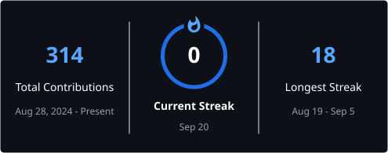

# 👋 Hi, I'm Gabriel Cattuzo

### Computer Engineering Student • Software & Systems Developer

**Building software from high-level applications to low-level systems.**

  
  
  

---

## 👨‍💻 About Me

I'm a **Computer Engineering student at PUC-Campinas** interested in software development and understanding how computers work across different abstraction levels.

My projects range from **web applications and high-level software** to **computer architecture, networking, operating systems and low-level programming**.

I enjoy working with algorithms, data structures and systems where software interacts closely with hardware.

* 🎓 Computer Engineering at **PUC-Campinas**
* 💻 Software Development & Computer Systems
* ⚙️ High-level and Low-level Programming
* 🌐 Networking & Web Development
* 🧠 Algorithms, Artificial Intelligence & Intelligent Systems
* 🖥️ Computer Architecture & Operating Systems
* 🇧🇷 Brazil
* 🗣️ Portuguese — Native • English

---

## 🚀 Featured Projects

### 🧊 Rubik's Cube AI Solver

Rubik's Cube solver developed in **C++**, focused on cube representation, movement simulation and algorithmic solving techniques.

The project explores **state representation, search algorithms, optimization and artificial intelligence concepts** applied to a complex combinatorial problem.

`C++` `Algorithms` `Artificial Intelligence` `Search`

---

### 🖥️ [Computer Systems Architecture](https://github.com/gabrielcattuzo/Arquitetura-de-Sistemas-Operacionais)

Studies and implementations focused on the interaction between software and hardware using **C and MIPS Assembly**.

Includes exercises involving **registers, memory, processor architecture and translation of high-level C structures into Assembly instructions**.

`C` `MIPS Assembly` `Computer Architecture` `Low-Level Programming`

---

### 🤖 [Intelligent Systems & Machine Learning](https://github.com/gabrielcattuzo/PI-Sistemas-Inteligentes-e-Machine-Learning)

Academic implementations involving **artificial intelligence, search algorithms and data structures**.

Includes implementations of **Breadth-First Search (BFS), Depth-First Search (DFS), trees, queues and state-space exploration**.

`C` `Artificial Intelligence` `BFS` `DFS` `Algorithms`

---

### 🚢 [Battleship in x86 Assembly](https://github.com/gabrielcattuzo/batalha-naval-assembly)

Implementation of the classic **Battleship game entirely in x86 Assembly**.

The project explores game logic while applying concepts related to **memory management, control flow and low-level programming**.

`Assembly x86` `Low-Level Programming` `Computer Architecture`

---

### 🔐 [Interactive Safe](https://github.com/gabrielcattuzo/cofre)

Interactive safe simulation developed in **C**, featuring password validation, multiple operating states and simulated communication between system components.

The project applies concepts involving **state machines, system logic and hardware/software interaction**.

`C` `State Machines` `Embedded Concepts`

---

### 🌱 [Semente Digital](https://github.com/gabrielcattuzo/semente.digital)

Web project focused on **Green IT and digital sustainability**, exploring topics such as energy consumption, electronic waste, carbon footprint and smart cities.

`HTML` `CSS` `JavaScript` `Green IT`

---

## 🛠️ Tech Stack

### Languages

  

  
  
  

### Web Development

  

### Databases

  

### Tools & Technologies

  

---

## 📊 GitHub Stats

---

## 🔥 Contributions

---

## 📈 Activity

---

## 🐍 Contribution Snake

---

## 📫 Connect with Me

Interested in software development, computer systems or technology?

Feel free to reach out.

  
  
  
  

