# 👋 Hi, I'm Gabriel Cattuzo

### Computer Engineering Student • Developer 

  
  

---

## 👨‍💻 About Me

I'm a **Computer Engineering student at PUC-Campinas** software development, computer systems, and learning how things work under the hood.

- 🎓 Computer Engineering student at **PUC-Campinas**
- 🇧🇷 Based in **Brazil**
- 🗣️ Portuguese (Native) • English
- 💻 Interested in **Software Development, Computer Systems, Networking, and Web Development**
- 🌐 Building projects for the web and exploring different areas of Computer Engineering
- 🚀 Always learning new technologies and improving my development skills

---

## 🚀 Tech Stack

### Languages

  
  
  
  
  
  
  

### Web Development

  
  
  

### Databases

  

### Tools & Technologies

  
  
  
  

---

## 📊 GitHub Stats

---

## 🔥 Contributions

 

---

## 📈 Activity

---

## 🐍 Contribution Snake

---

## 📫 Connect with Me

